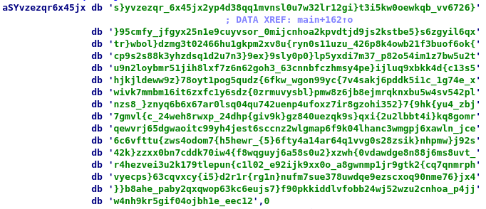

# ghost-in-the-system

## Description

```
I think my ls is being haunted... the colors are all weird!!! What's that? It's highlighting things?! Where!!?
```

### Hints

```
Flag is 100 characters long.
It starts with rtcp{ and ends with }
The first character is w
```

```
The flag is written in standard leet, the only exceptions are the flag wrapping (rtcp{}) and underscores (_)
```

## Walkthrough

First, let's open the provided `ls` binary in IDA. After the initial analysis, check out the `main` function. We see an interesting stack variable: `flg`.

```
flg= byte ptr -80h
```

This is worth looking into. Highlight `flg` and press `x` to view cross references to `flg`.


We see 100 writes and two reads. Interesting. Our first hint told us the flag is 100 characters long. Let's take a closer look at these writes. Double-click on the first xref to end up at address `main+145`.

```
main+145                  lea     rax, [rbp+__for_end]
main+14C                  mov     rdi, rax
main+14F                  call    __ZNSaIcEC1Ev   ; std::allocator<char>::allocator(void)
main+154                  lea     rdx, [rbp+__for_end]
main+15B                  lea     rax, [rbp+otxt]
main+162                  lea     rsi, aSYvzezqr6x45jx ; "s}yvzezqr_6x45jx2yp4d38qq1mvnsl0u7w32lr"...
main+169                  mov     rdi, rax
main+16C                  call    __ZNSt7__cxx1112basic_stringIcSt11char_traitsIcESaIcEEC1EPKcRKS3_ ; std::__cxx11::basic_string<char,std::char_traits<char>,std::allocator<char>>::basic_string(char const*,std::allocator<char> const&)
main+171                  lea     rax, [rbp+__for_end]
main+178                  mov     rdi, rax
main+17B                  call    __ZNSaIcED1Ev   ; std::allocator<char>::~allocator()
main+180                  lea     rax, [rbp+otxt]
main+187                  mov     esi, 1F0h
main+18C                  mov     rdi, rax
main+18F                  call    __ZNSt7__cxx1112basic_stringIcSt11char_traitsIcESaIcEEixEm ; std::__cxx11::basic_string<char,std::char_traits<char>,std::allocator<char>>::operator[](ulong)
main+194                  movzx   eax, byte ptr [rax]
main+197                  mov     [rbp+flg], al
main+19A                  lea     rax, [rbp+otxt]
main+1A1                  mov     esi, 192h
main+1A6                  mov     rdi, rax
main+1A9                  call    __ZNSt7__cxx1112basic_stringIcSt11char_traitsIcESaIcEEixEm ; std::__cxx11::basic_string<char,std::char_traits<char>,std::allocator<char>>::operator[](ulong)
main+1AE                  movzx   eax, byte ptr [rax]
main+1B1                  mov     [rbp+flg+1], al
main+1B4                  lea     rax, [rbp+otxt]
main+1BB                  mov     esi, 322h
main+1C0                  mov     rdi, rax
main+1C3                  call    __ZNSt7__cxx1112basic_stringIcSt11char_traitsIcESaIcEEixEm ; std::__cxx11::basic_string<char,std::char_traits<char>,std::allocator<char>>::operator[](ulong)
main+1C8                  movzx   eax, byte ptr [rax]
main+1CB                  mov     [rbp+flg+2], al

; etc...

```

So what is this code doing? It seems like it is first initializing a C++ `std::string` object at `[rbp+otxt]` with the string stored at `aSYvzezqr6x45jx`. If we follow this location in the binary, we will see a long string of seemingly random characters:



Then, it begins to make many calls to the `[]` operator of the `std::string` object at `[rbp+otxt]`, with seemingly random offsets, storing each result to an increasing offset from `[ebp+flg]`. So the code effectively becomes something like:

```
flg[0] = otxt[496]; // 1f0h
flg[1] = otxt[402]; // 192h
flg[2] = otxt[802]; // 322h
// etc...
```

At this point, we could write a script to assemble a flag by pulling the appropriate offset from the "random" text for each index of our flag. An easier way would be to use a decompiler to generate C code, reformat as necessary, and print the assembled flag. These would both, of course, be tedious and time-consuming processes. There is a better way.

Remember the reads to `[rbp+flg]`?


Let's check out the first one. Double-click on it to jump here:

```
main+BB2                  lea     rdx, [rbp+flg]
main+BB6                  lea     rax, [rbp+str]
main+BBD                  mov     rsi, rdx        ; __rhs
main+BC0                  mov     rdi, rax        ; __lhs
main+BC3                  call    _ZSteqIcSt11char_traitsIcESaIcEEbRKNSt7__cxx1112basic_stringIT_T0_T1_EEPKS5_ ; std::operator==<char,std::char_traits<char>,std::allocator<char>>(std::__cxx11::basic_string<char,std::char_traits<char>,std::allocator<char>> const&,char const*)
main+BC8                  test    al, al
main+BCA                  jz      short loc_1D2F
```

Here we see where the assembled "real" flag at `[rbp+flg]` is being compared with a string we've supposedly entered, at `[rbp+str]`. If we jump into a debugger and set a breakpoint at `main+0xbb6`, the "real" flag should conveniently be sitting at an address pointed to by `rdx`. But there's still one small problem: we need to ensure execution actually reaches this block of code.

So let's fire up `gdb`. Set a breakpoint on the `main` function with `b *main`. Run the program with `run`, and we arrive at the beginning of the `main` function.


We need to `jump` to the instructions that build the flag, but first we need to ensure that our stack is set up correctly. Using `n`, step through the first few lines of the `main` procedure. Stepping until the `call opendir` is more than enough.

Now, set a breakpoint at the beginning of the code block that builds the flag: `b *main+0x145`. Jump to the same instruction with `jump *main+0x145`. Next, set a breakpoint directly after a pointer to our "real" flag is stored in `rdx`: `b *main+0xbb6`. Now `continue`.

When `gdb` reaches our breakpoint, a pointer to the flag string will be stored in `rdx`. Simply use `x/s $rdx` and our flag will be printed for us!

```
> x/s $rdx
0x7fffffffe2f0: "rtcp{wh37h3r_1n4n1m473_f16ur35_0r_un4u7h0r1z3d_c0d3_7h3r35_4lw4y5_4_6h057_1n_7h3_5y573m_1056_726_00}UU"
```

There are a few extra junk characters printed after the flag. No problem. Simply remove the extra characters and submit.
